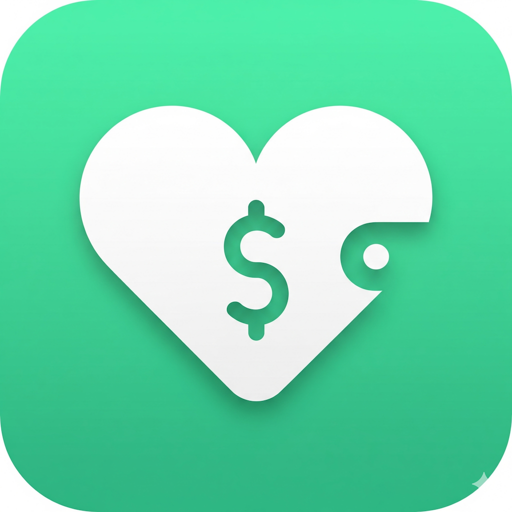

# DailySpend



**Private spending. Fair splitting.**

DailySpend is a native SwiftUI expense tracker and bill-splitting app for iPhone and iPad. Track purchases, follow budgets, calculate each person's share, and export a clear receipt. It calculates amounts owed; it does not transfer money or connect to bank accounts.

## Current status

**Version 1.0 — final TestFlight testing candidate.** This is not an announcement of App Store approval or public availability. The current project version is **1.0 (14)**; confirm the actual uploaded build in App Store Connect. If that build number has already been used, a subsequent upload needs a new build number.

The September 2026 update includes:

- **New wallet branding:** a mint/teal wallet icon replaces the old heart branding, with matching artwork in Settings and the refreshed About page.
- **More dependable editing:** full-card transaction tap targets and coordinated Add/Edit presentation. Widget Quick Add waits for an existing edit to finish.
- **Clearer transaction rows:** red destructive swipe actions, multiline notes, and natural recurring labels instead of appended “(Auto)” text.
- **Better split receipts:** shared subtotals expand into individual items with each person's allocated amount and actual participant names. Long names wrap; a bitmap export path avoids blank tall receipts.
- **Polished amount entry:** the currency symbol sits beside the bill amount, numeric keyboards have a dismiss action, and decimal-comma input retains cents.
- **Widget and privacy refinements:** exact-cent snapshots, explicit empty/stale states, improved navigation, and hidden balances when App Lock is enabled and the widget refreshes.
- **Safer data handling:** validated backup imports, replacement-restore safeguards, CSV formula protection, and rollback of unsuccessful recurring-entry saves.

## Features

### Track spending

Add, edit, and categorize expenses with dates and notes. Set daily, weekly, monthly, or yearly recurring entries. Review monthly spending, category breakdowns, charts, and activity history. Set overall and category budgets, with optional local reminders.

Receipt scanning uses the camera and on-device text recognition to **suggest** a total. Review the amount before saving; recognition is not guaranteed to be correct.

### Split fairly

- Divide a total evenly or assign personal and shared items to selected people.
- Include tax and percentage or fixed tips.
- Allocate rounding differences in cents so final shares reconcile with the bill.
- Export a per-person receipt and optionally record your own share as an expense.

A person's shared-item prices are **their allocated shares**, not full item prices. For example, $3 + $4 gives that person's $7 shared subtotal. Participant names identify who shared each item.

Unrecorded split calculations are temporary, not a persistent group-debt ledger.

### Widgets

Quick Add opens a new expense. Small and medium dashboard widgets show spending and budget information. iOS controls refresh timing, so saved changes may not appear immediately. Old snapshots can prompt you to open the app for a refresh.

### Privacy and portability

- No app-account registration, ads, subscriptions, in-app purchases, third-party analytics, or tracking.
- On-device expense storage, with private CloudKit sync when iCloud is available and enabled.
- Optional App Lock using device authentication and hidden financial content in the app switcher.
- Passphrase-encrypted JSON backups using Apple's CryptoKit and CommonCrypto. The passphrase is not stored or recoverable.
- Validated restore, merge, and replacement with a required safety backup before replacement.
- CSV exports are readable, **unencrypted**, and are not full backups. Earlier JSON backups may also be unencrypted.

iCloud sync is not an independent backup history: deletions can sync too. After enabling App Lock, iOS may temporarily retain an old rendered widget; remove it if its contents must be hidden immediately.

See the [privacy policy](docs/privacy/index.html) and [support page](docs/support/index.html).

## Build and run

- Deployment target: **iOS/iPadOS 17.0 or later**.
- Validation toolchain: **Xcode 26.6** on macOS. Use a recent Xcode that supports the project's synchronized folders and Swift settings; the old Xcode 15 instructions no longer apply.
- Frameworks: SwiftUI, SwiftData, CloudKit, Swift Charts, Vision/VisionKit, WidgetKit, UserNotifications, LocalAuthentication, CryptoKit, and CommonCrypto.

```bash
git clone https://github.com/ShadowSkeleton/DailySpend.git
cd DailySpend
open DailySpend.xcodeproj
```

Select the shared **DailySpend** scheme and an installed iPhone/iPad simulator, then run. For signed device builds, configure the appropriate development team and provisioning capabilities.

### Existing app identity

The public brand is DailySpend. These legacy identifiers deliberately remain unchanged for the existing distributed app:

| Purpose | Identifier |
|---|---|
| App bundle | `com.jackson.LoveLedger` |
| Private iCloud container | `iCloud.com.jackson.LoveLedger` |
| App Group | `group.com.jackson.LoveLedger` |
| Widget extension | `com.jackson.LoveLedger.LoveLedgerWidget` |

Do not rename them as a branding cleanup. They identify the existing app, storage, and shared widget data. A separate developer's fork needs its own registered identifiers and signing configuration; it cannot use the original developer's private CloudKit container.

For production-backed TestFlight testing, deploy the tested CloudKit schema to Production and verify sync on signed physical devices. Simulator tests do not prove production CloudKit access.

## Tests and release checks

Latest verification, **September 10, 2026**: Release simulator build and **50 tests passed** (38 unit/data tests and 12 UI tests) on iPhone 17e / iOS 26.5 with Xcode 26.6. The Debug-only demo-data test was excluded from this Release run.

The shared scheme includes `DailySpendTests` and `DailySpendUITests`. Choose a simulator and press **Command-U** in Xcode to run the default Debug suite.

For Release testing, substitute an available simulator name:

```bash
xcodebuild test \
  -project DailySpend.xcodeproj \
  -scheme DailySpend \
  -configuration Release \
  ENABLE_TESTABILITY=YES \
  -destination 'platform=iOS Simulator,name=iPhone 17e' \
  -parallel-testing-enabled NO \
  -skip-testing:DailySpendUITests/DailySpendUITests/testDebugDemoDataMakesDashboardAndInsightsTestable
```

`ENABLE_TESTABILITY=YES` is a test-command override for unit tests' `@testable` import, not a shipping-build requirement. The skipped test exercises a Debug-only demo-data feature.

Automated checks cover exact-cent allocations, receipt export, backup validation/encryption, recurrence/data migration, widget snapshots/privacy, keyboard dismissal, navigation, and transaction-sheet presentation. They do not replace physical-device checks for camera permissions, authentication, notifications, signed iCloud sync, installed-widget appearances, or upgrading an existing TestFlight installation.

- [Owner test plan, edge cases, and expected results](docs/PRE_UPLOAD_TEST_PLAN.md)
- [App Store release checklist](docs/APP_STORE_RELEASE_CHECKLIST.md)
- [Current TestFlight tester notes](docs/TESTFLIGHT_NOTES.md)

## Project guide

For everyday development, follow the [development workflow](docs/DEVELOPMENT_WORKFLOW.md) and [definition of done](docs/DEFINITION_OF_DONE.md). Pull requests use structured review templates and Debug/Release simulator CI with synthetic data, disabled signing, and no custom secrets. Hosted CI is limited to public repositories using standard free runners; release and migration safety checks remain separate.

| Path | Purpose |
|---|---|
| `DailySpend/Expense.swift`, `Money.swift`, `MoneyStoreMigration.swift` | Expense model, exact-cent arithmetic, migration |
| `DailySpend/HomeViews.swift`, `TransactionViews.swift` | Dashboard and entry/edit flows |
| `DailySpend/SplitBillLogic.swift`, `SplitBillView.swift` | Split calculations and receipt export |
| `DailySpend/SettingsView.swift`, `SecureBackupCodec.swift` | Settings, About, backup and restore |
| `DailySpend/SceneProtectionWindow.swift` | Scene-level privacy protection |
| `DailySpend/WidgetSnapshot.swift`, `DailySpendWidget/` | Shared widget data and UI |
| `DailySpendTests/`, `DailySpendUITests/` | Automated regression checks |
| `docs/` | Public support/privacy pages and release documentation |

Local QA captures, personal Xcode settings, build products, and the separate App Store marketing kit are not included in this repository.

Created by **Jackson Feng**. Support: **jacksonfeng0130@yahoo.com**.
